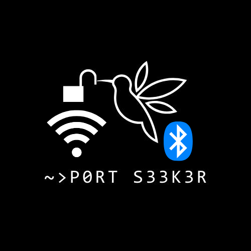
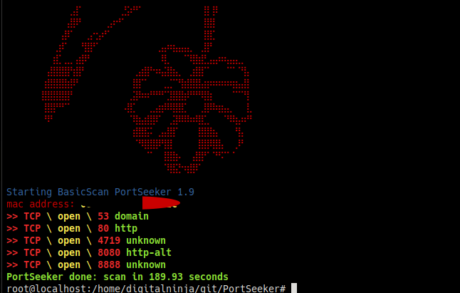
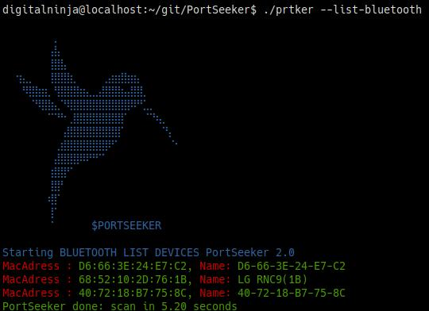

# PortSeeker version: 2.0
<center>
    <br>
    
    
</center>
* 
Port Scanner, opensource and programmed in C++ for linux distros.

### Free Open-Source vulnerability scanner
#### For arch based distros
##You need to run this program with administrator permissions
```
sudo bash arch_start.sh
./prtker -h
```
#### For debian based distros
```
sudo bash debian_start.sh
sudo ./prtker

```
### execute
```
sudo ./prtker -h
```
### MANUAL INSTALACION
### install dependencies
```
ARCHLINUX=====>
sudo pacman -Syy
sudo pacman -S python
sudo pacman -S python-pip
sudo pacman -S nc
sudo pacman -S nmap
sudo pacman -S arping
sudo pacman -S gcc
sudo pacman -S curl
DEBIAN======>
sudo apt -y install libcurl4-openssl-dev
sudo apt -y install g++
sudo apt -y install netcat
sudo apt -y install nc
sudo apt -y install arping
sudo apt -y install nmap
sudo apt -y install python3
sudo apt -y install python3-pip

```

###install python3 libraries

```
pip3 install scapy --break-system-packages
pip3 install colorama --break-system-packages
pip3 install asyncio --break-system-packages
pip3 install bleak --break-system-packages
```
OR
```
pip3 install -r requirements.txt --break-system-packages
```
### COMPILE CODE
```
g++ setup.cpp -o prtker -std=c++11 -lcurl
```
### Commands
```
!!!!!everything must be run as root!!!!
################LAN NETWORK TOOLS###################
./prtker 192.168.0.1 ---> BasicScan
./prtker 192.168.0.1 -sV ---> Port Version Scan
./prtker 192.168.0.1 -p 80 ---> specific port
./prtker 192.168.0.1 --httpGET --> http requests
./prtker 192.168.0.1 --httpsGET --> https requests
./prtker 192.168.0.1 --arp --> get mac address
./prtker 192.168.0.1 --icmp --> icmp requests
./prtker 192.168.0.1 --osdetection --> os detection
./prtker 192.168.0.1 --CRAZYMODE --> all in one
#################BLUETOOTH TOOLS#####################
./prtker --list-bluetooth --> list bluetooth devices
./prtker <FF:FF:FF:FF:FF> --bluetooth-connect --> connect to a device
```
## info commands
```
./prtker --help
./prtker -h
./prtker --version
```
## Improvements:

```
>>> New features for bluetooth
>>> New function for ICMP requests
>>> New function to obtain mac address
>>> Http and https requests are returned
>>> Now with new help menu with the "--help" option
>>> Optimized code
>>> new port version scanning function
>>> New colors on console ***
>>> New feature for quieter network scans
>>> Feature to obtain server status code
>>> Performance improvement
>>> Friendlier Banner and UI
```

## Authors

@DigitalNinja00
@jsposu
@Cr0w-ui