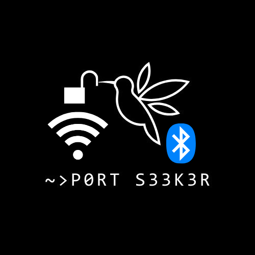

# PortSeeker version: 1.4
<center>
    
</center>
* 
Port Scanner, opensource and programmed in C++ for linux distros.

### Free Open-Source vulnerability scanner
#### For arch based distros
```
pacman -S curl
g++ compile.cpp -o prtker -std=c++11 -lcurl
```
#### For debian based distros
```
sudo bash start.sh
./prtker

```
### execute
```
./prtker
```
## Improvements:

```
>>> New feature for quieter network scans
>>> Feature to obtain server status code
>>> Performance improvement
>>> Code enhancements
>>> Friendlier Banner and UI
```

## Authors

@DigitalNinja00
@jsposu
