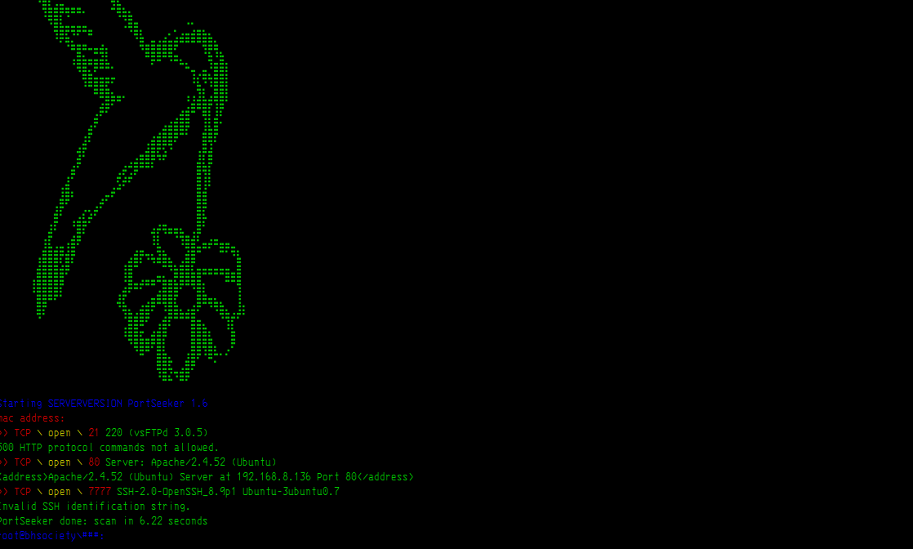
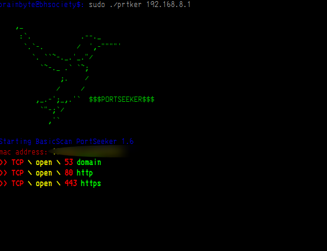

# PortSeeker version: 1.7
<center>
    <br>
    
    
</center>
* 
Port Scanner, opensource and programmed in C++ for linux distros.

### Free Open-Source vulnerability scanner
#### For arch based distros
##You need to run this program with administrator permissions
```
pacman -S curl
g++ compile.cpp -o prtker -std=c++11 -lcurl
```
#### For debian based distros
```
sudo bash start.sh
./prtker

```
### execute
```
./prtker
```
### Commands
```
!!!!!everything must be run as root!!!!

./prtker 192.168.0.1 ---> BasicScan
./prtker 192.168.0.1 -sV ---> Port Version Scan
./prtker 192.168.0.1 -p 80 ---> specific port
./prtker 192.168.0.1 --httpGET --> http requests
./prtker 192.168.0.1 --httpsGET --> https requests

```
###INFO COMMANDS
```
./prtker --help
./prtker -h
./prtker --version
```
## Improvements:

```
>>> Http and https requests are returned
>>> Now with new help menu with the "--help" option
>>> Optimized code
>>> new port version scanning function
>>> New colors on console ***
>>> New feature for quieter network scans
>>> Feature to obtain server status code
>>> Performance improvement
>>> Friendlier Banner and UI
```

## Authors

@DigitalNinja00
@jsposu
@Cr0w-ui
